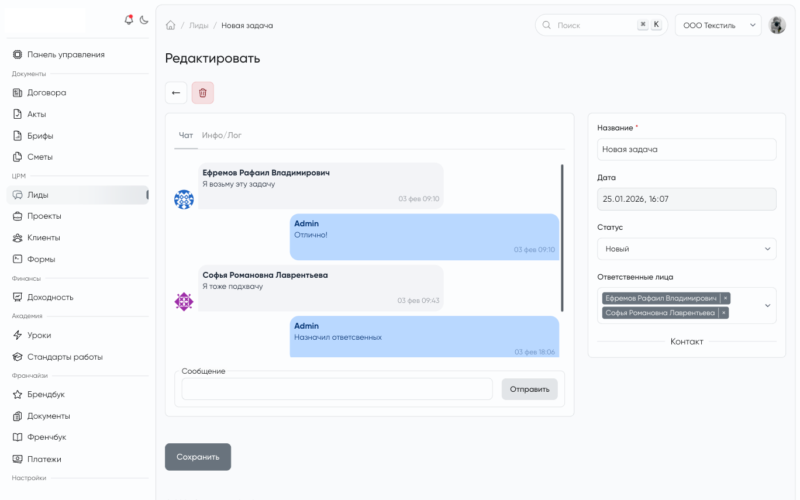

# MoonShine Commentable for [MoonShine Laravel admin panel](https://moonshine-laravel.com)

`dissnik/moonshine-commentable` adds a comment field for MoonShine resources and a small comment domain for Eloquent models.

<picture>
    
</picture>

## Requirements

- PHP 8.1+
- MoonShine 4
- Laravel application with Eloquent models

## Installation

Install the package:

```bash
composer require dissnik/moonshine-commentable
```

Publish package files:

```bash
php artisan vendor:publish --tag=moonshine-commentable-migrations
php artisan vendor:publish --tag=moonshine-commentable-config
php artisan vendor:publish --tag=moonshine-commentable-lang
php artisan vendor:publish --tag=moonshine-commentable-assets
```

Run migrations:

```bash
php artisan migrate
```

The package creates two tables:

- `comments`
- `comment_reads`

## Model Setup

### Commentable model

Add the contract and trait to the model that should store comments:

```php
<?php

namespace App\Models;

use DissNik\MoonShineCommentable\Contracts\CommentableContract;
use DissNik\MoonShineCommentable\Traits\HasComments;
use Illuminate\Database\Eloquent\Model;

class Post extends Model implements CommentableContract
{
    use HasComments;
}
```

### Comment author model

The authenticated author should implement `CommenterContract`:

```php
<?php

namespace App\Models;

use DissNik\MoonShineCommentable\Contracts\CommenterContract;
use Illuminate\Foundation\Auth\User as Authenticatable;

class User extends Authenticatable implements CommenterContract
{
    public function getCommenterName(): string
    {
        return $this->name;
    }

    public function getCommenterAvatar(): ?string
    {
        return $this->avatar_url;
    }
}
```

By default the package uses `CommenterContract::getCommenterName()` and `getCommenterAvatar()` for author presentation. You can also override this in config through the `presenters.author_name` and `presenters.author_avatar` callbacks.

## MoonShine Resource

Add the field to the resource that manages the commentable model:

```php
<?php

namespace App\MoonShine\Resources;

use App\Models\Post;
use DissNik\MoonShineCommentable\Fields\Comment;
use MoonShine\Laravel\Resources\ModelResource;

class PostResource extends ModelResource
{
    protected string $model = Post::class;

    public function fields(): array
    {
        return [
            // ...
            Comment::make('Comments', 'comments'),
        ];
    }
}
```

Comments are shown after the main model is saved, because the field needs the record key and morph type.

## Working With Comments

The `HasComments` trait adds the following relations:

- `comments(): MorphMany`
- `commentReads(): MorphMany`

You can create a comment from code:

```php
$post->comment('First comment', $user);
$post->comment('Reply to comment #10', $user, 10);
$post->comment('Comment with payload', $user, payload: ['attachments' => 1]);
```

The package no longer accepts the old self-passed signature such as `comment($post, ...)`.

The default comment model stores:

- `commentable_id`
- `commentable_type`
- `author_id`
- `author_type`
- `parent_id`
- `text`
- `payload`

## Unread State

The package also stores read markers for each reader and commentable model.

Available methods from `HasComments`:

```php
$post->markCommentsAsRead($user);

$post->hasUnreadComments($user);
$post->unreadCommentsCount($user);
```

There are also query scopes:

```php
Post::query()
    ->withUnreadCommentsState($user)
    ->withUnreadCommentsCount($user)
    ->get();
```

By default these scopes expose:

- `has_unread_comments`
- `unread_comments_count`

You can pass custom column names as the second argument.

## Configuration

The published config file is `config/moonshine-commentable.php`.

```php
return [
    'models' => [
        'comment' => DissNik\MoonShineCommentable\Models\Comment::class,
        'comment_read' => DissNik\MoonShineCommentable\Models\CommentRead::class,
    ],
    'policies' => [
        'comment' => DissNik\MoonShineCommentable\Policies\CommentPolicy::class,
    ],
    'commentables' => [
        'resolver' => null,
        'authorize' => null,
    ],
    'presenters' => [
        'author_name' => null,
        'author_avatar' => null,
    ],
    'moonshine' => [
        'register_resource' => true,
        'resource' => DissNik\MoonShineCommentable\Resources\CommentResource::class,
        'pages' => [
            'index' => DissNik\MoonShineCommentable\Resources\Pages\CommentIndexPage::class,
            'form' => DissNik\MoonShineCommentable\Resources\Pages\CommentFormPage::class,
        ],
        'events' => [
            'comment_added' => 'moonshine-commentable:comment-added',
        ],
    ],
    'ui' => [
        'height' => '600px',
        'threshold' => 200,
    ],
    'transport' => [
        'mode' => 'polling',
        'signals' => [
            'comment_created' => 'comment.created',
        ],
        'payload' => [
            'version' => 1,
        ],
        'publisher' => null,
        'polling' => [
            'interval' => null,
        ],
    ],
];
```

### Model and policy overrides

Use these keys to replace the default classes:

- `models.comment`
- `models.comment_read`
- `policies.comment`
- `commentables.resolver`
- `commentables.authorize`
- `presenters.author_name`
- `presenters.author_avatar`

### Commentable resolver and authorization

Use `commentables.resolver` to lock comment lookup to your own host models instead of trusting raw `commentable_id` and `commentable_type` request values.

Use `commentables.authorize` to decide whether the current actor may `view`, `create`, `reply`, `update`, or `delete` comments for a resolved host model.

If your host model implements `CommentableAccessContract`, the package can use that directly when no config callback is provided.

### MoonShine integration

Use these keys to customize MoonShine integration:

- `moonshine.register_resource`
- `moonshine.resource`
- `moonshine.pages.index`
- `moonshine.pages.form`
- `moonshine.events.comment_added`

By default the package registers its `CommentResource` in MoonShine and keeps it out of the menu.

### UI options

- `ui.height` controls the maximum height of the comments list
- `ui.threshold` controls the auto-scroll threshold

### Transport options

The transport section is intended for projects that want to publish comment events to their own infrastructure.

- `transport.mode`
- `transport.signals.comment_created`
- `transport.payload.version`
- `transport.publisher`
- `transport.polling.interval`

## Custom Publisher

If you want to publish comment events to WebSocket, broadcast, queue, or any other transport, implement `CommentPublisherContract`:

```php
<?php

namespace App\Comments;

use DissNik\MoonShineCommentable\Contracts\CommentPayloadContract;
use DissNik\MoonShineCommentable\Contracts\CommentPublisherContract;

class RealtimeCommentPublisher implements CommentPublisherContract
{
    public function publish(CommentPayloadContract $payload): void
    {
        // Publish $payload->toArray() to your transport
    }
}
```

Then register it in the config:

```php
'transport' => [
    'publisher' => App\Comments\RealtimeCommentPublisher::class,
],
```

The payload contains:

- signal name
- payload version
- transport name
- comment data
- commentable model identifier
- author identifier

## Custom MoonShine Resource and Pages

If you need a different resource or page implementation, point the config to your own classes:

```php
'moonshine' => [
    'resource' => App\MoonShine\Resources\CommentResource::class,
    'pages' => [
        'index' => App\MoonShine\Pages\CommentIndexPage::class,
        'form' => App\MoonShine\Pages\CommentFormPage::class,
    ],
],
```

## Policies

The default policy allows:

- view: delegated to the configured commentable authorization seam
- create: allowed at the model policy layer, with host authorization enforced during comment creation
- reply: delegated to the configured commentable authorization seam
- update: only for the comment author and only when the host authorization seam allows it
- delete: only for the comment author and only when the host authorization seam allows it

Replace `policies.comment` if your application needs different rules.

## Translations and Assets

The package includes:

- language files in `lang/en` and `lang/ru`
- published assets in `public/vendor/moonshine-commentable`

## Testing

Run the package tests with:

```bash
./vendor/bin/phpunit
```
